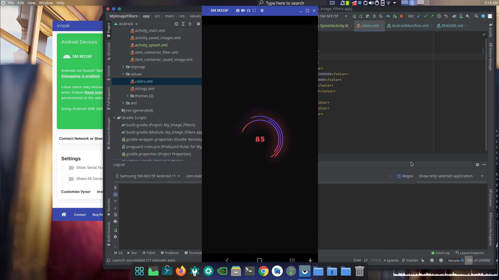
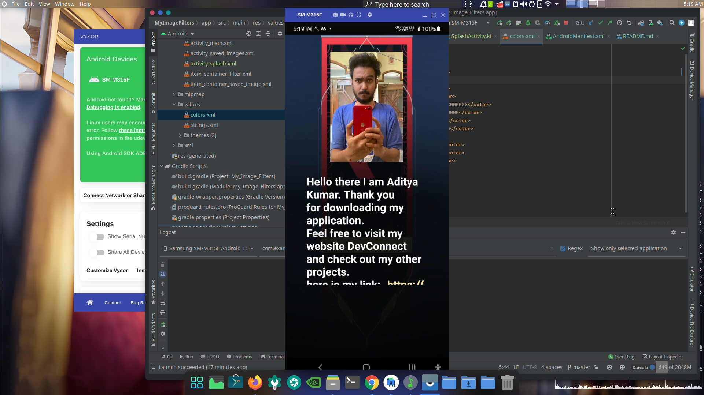
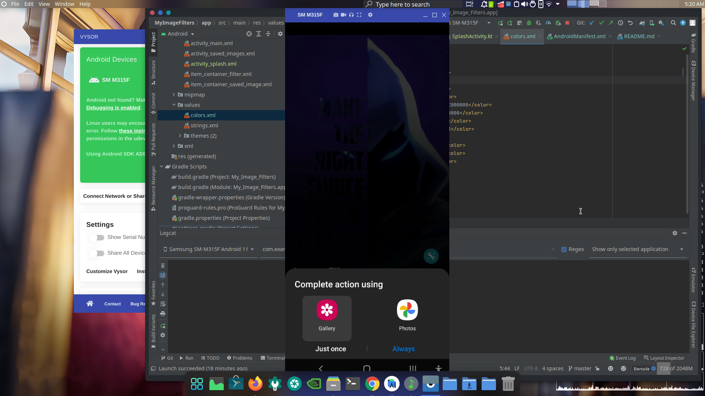
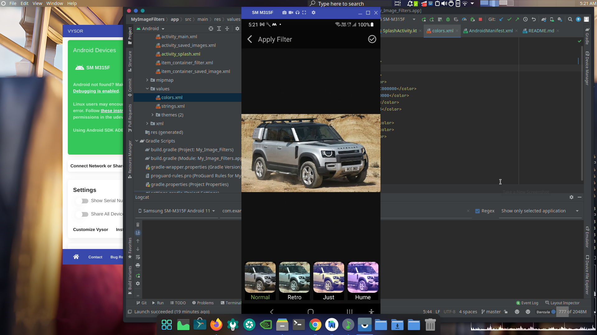
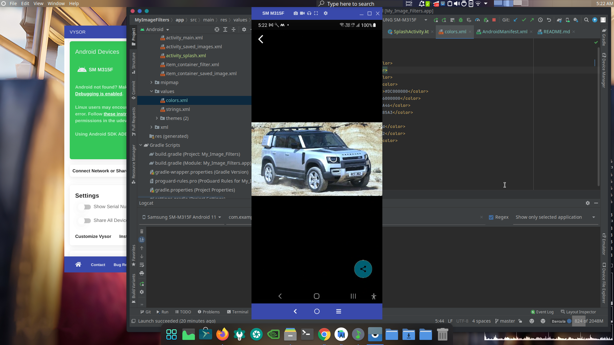
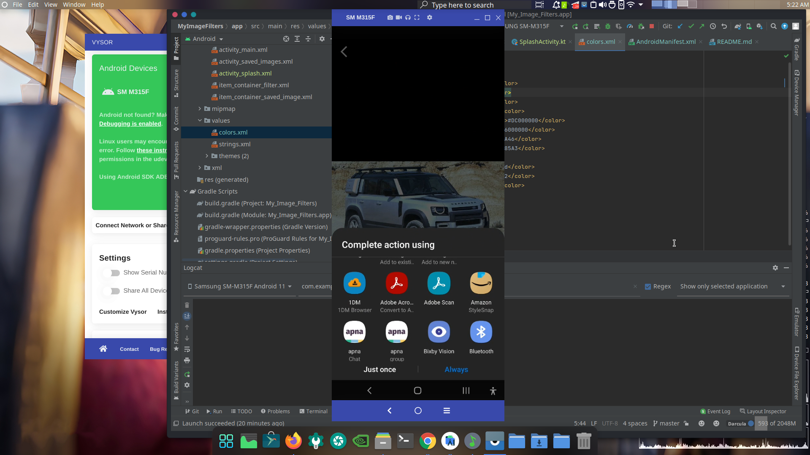
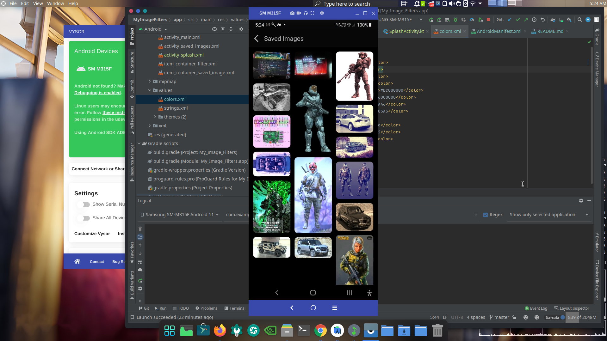

This allows users to put filters on their images, Users can import images from their phone's gallery , apply a filter of their choosing, and share the filtered images onto other apps like WhatsAPP, Telegram etc..

If you want to Demo this application then go to the releases section and download the apk for this application from there.

Here are some Previews of this Application->

