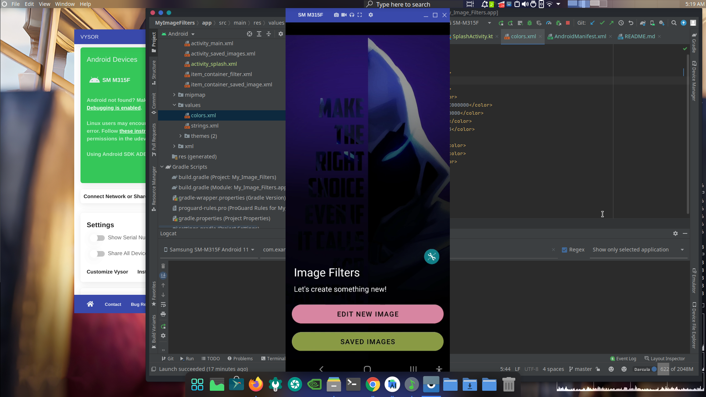

This allows users to put filters on their images, Users can import images from their phone's gallery , apply a filter of their choosing, and share the filtered images onto other apps like WhatsAPP, Telegram etc..

Here are some Previews of this Application->

